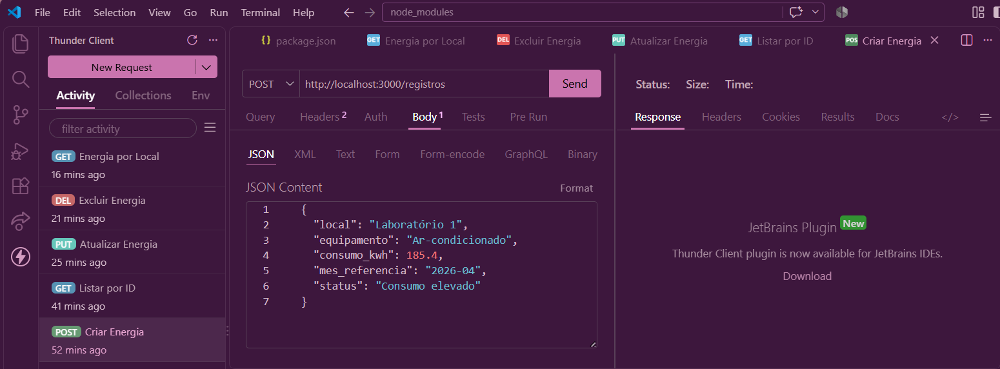

# Aula07 - VPF01
## Rastreamento de consumo e desperdício de energia

Sistema desenvolvido para o SESI com o objetivo de registrar equipamentos e locais, acompanhar o consumo de energia elétrica e identificar possíveis situações de desperdício.

---

## Descrição

O sistema permite cadastrar e gerenciar registros de equipamentos e seus respectivos consumos de energia.

Cada registro possui:

- ID
- Local
- Equipamento
- Consumo em kWh
- Mês de referência
- Status do consumo

---

## Tecnologias
- **Node.sj**
- **JavaScript**
- **VsCode**
- **VsCode** Thunder Client

---

## Passos para testar
- 1 Clone este repositório
- 2 Abra com **VsCode** e em um terminal digite:
```bash
npm install
npm run dev
```
- 3 Teste as rotas com a extensão `Thunder Client` do **VsCode**
- 4 Abra o arquivo client/index.html com a extensão `Live Server` do **VsCode**

---

## Print dos testes e exemplo de requisições
- CREATE

- READ ALL

- BUSCAR

- UPDATE

- DELETE


---

## Ciente
- 
- Resposta:
- 
